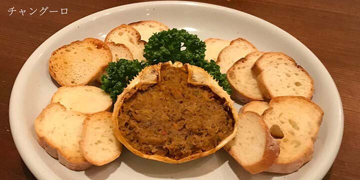

  

    <h2 class="mv__content--heading">FOOD</h2>
  

  <section class="food">
    <!-- 

      <h2 class="food__heading1"></h2>
      

        

          
          
        

        

          

            <h3 class="food__list--heading1">今月のオススメ</h3>
            

              

                
とても辛いポテト　ブラバ風揚げポテトにピリッと辛いブラバソースをきかきせた料理。ビールに最適！

                
¥680-

              

              

                
ガスパチョ（夏季のみ）この季節ならではの一品　当店で人気のメニュー

                
¥700-

              

              

                
野菜の煮込み　ラマンチャ風パプリカ・ズッキーニなどの夏野菜をトマトと一緒に煮込んだ栄養満点の料理

                
¥780-

              

              

                
豚ロースのオリーブソース　アンダルシア風豚ロースをソテーしてブラックオリーブブラックオリーブソースで絡ませた夏向きの料理

                
¥1,200-

              

            

          

        

      

    
 -->
    <!-- 

      <h2 class="food__heading1"></h2>
      

        

          
          
        

        

          

            <h3 class="food__list--heading1">おまかせコース</h3>
            

              

                
スペイン風オムレツスペイン独特のポテト入りオムレツ

                
¥800-

              

              

                
ハモン・セラーノヘルシーなホーレン草入りのオムレツ

                
¥850-

              

              

                
ウエボス・ア・ラ・フラメンカ卵と生ハム・チョリソのアンダルシア風オーブン焼

                
¥850-

              

            

          

        

      

    
 -->
    

      <h2 class="food__heading1"></h2>
      

        

          
          
          
          
        

        

          

            <h3 class="food__list--heading1">タパス</h3>
            

              

                
たこのマリネたこをオリーブオイルとビネガーで味付けしたさっぱりとした前菜

                
¥780-

              

              

                
スペアリブのワイン煮赤ワインとサルサ・エスパニョーラで柔らかく煮込んだスペアリブ

                
¥950-

              

              

                
エスカルゴの辛味ソース煮赤唐辛子をピリッときかせたソースで仕上げたエスカルゴ

                
¥1,000-

              

              

                
ギンディージャ鷹の爪の酢漬け

                
¥480-

              

              

                
オリーブの実グリーンブラックの盛り合わせ

                
¥480-

              

              

                
松の実乾煎りした塩味の松の実。ピールこと

                
¥480-

              

              

                
チョリソ・フリートスペイン風腸詰めのオリーブ油焼き

                
¥850-

              

              

                
ハモン・セラーノスペインの生ハム

                
¥1,800- ハーフ：¥950-

              

              

                
鶏きものにんにくソテー鶏の砂肝とレバーをニンニクとオリーブ油で炒めた絶品

                
¥680-

              

              

                
牛ミノの煮込みマドリード風マドリードの名物、牛ミノの煮込み

                
¥1,300-

              

              

                
真だこのガリシア風軽く塩茹でした真だこにパプリカをふりかけます

                
¥780-

              

              

                
帆立貝のオリーブ油焼き生食帆立貝をオリーブ油とガーリック少々でソテーします

                
¥950-

              

              

                
イカと海老のロマーナスペイン風　海老とイカの天ぷら

                
¥800-

              

              

                
小海老のニンニク・ソテー小海老をオリーブ油とガーリック少々で炒めた前菜

                
¥680-

              

              

                
海老の鉄板焼き海老の岩塩をふりかけたシンプルな鉄板焼き

                
¥800-

              

              

                
海老の塩茹で塩茹でした海老をガーリックマヨネーズでどうぞ

                
¥780-

              

              

                
アサリのワイン蒸しアサリの白ワイン蒸し

                
¥750-

              

              

                
アサリの漁師風アサリの風味と漁師風ソースのこくのある一品

                
¥850-

              

              

                
マッシュルームのセゴビア風カットした生マッシュルームオリーブ油ソテー

                
¥680-

              

              

                
マッシュルームのオリーブ油焼き生マッシュルームを高野爪と少々のニンニクで炒めた一品

                
¥780-

              

            

          

        

      

    

    

      <h2 class="food__heading1"></h2>
      

        

          
          
        

        

          

            <h3 class="food__list--heading1">パエーリャ</h3>
            

              

                
パエーリャ・バレンシアナ（2人前）

                
¥3,600-

              

              

                
魚介類のパエーリャ（2人前）

                
¥2,800-

              

              

                
イカ墨のパエーリャ（2人前）

                
¥2,800-

              

              

                
鶏肉のパエーリャ辛味仕立て（2人前）

                
¥2,800-

              

              

                
きのこのパエーリャ（2人前）

                
¥2,600-

              

            

          

        

      

    

    

      <h2 class="food__heading1"></h2>
      

        

          
          
          
        

        

          

            <h3 class="food__list--heading1">サラダ</h3>
            

              

                
ミックス・サラダ

                
¥750-

              

              

                
レタスとトマトのサラダ

                
¥700-

              

              

                
タコとポテトのサラダ

                
¥680-

              

              

                
魚介類のサラダ

                
¥1,000-

              

            

          

        

      

    

    

        <h2 class="food__heading1"></h2>
        

          

            
            
          

          

            

              <h3 class="food__list--heading1">魚・肉の料理</h3>
              

                

                  
ヤリイカの墨煮　バスク風ヤリイカをその真っ黒な墨で煮込んだスペイン名物料理で、独特なこくと風味に定評があります。

                  
¥1,500-

                

                

                  
チャングーロ蟹のみそと身を甲羅に詰めてオーブンで焼いたバスク地方の珍味です。

                  
¥1,600-

                

                

                  
片口いわしのマリネスペインで人気のある小イワシのマリネ

                  
¥780-

                

                

                  
若鶏のチリンドロン・ソース煮（2人前）若鶏をチリンドロンソースで蒸し煮にしたナバーラ地方の代表的な料理です。

                  
¥1,800-

                

                

                  
和牛ロース・ソテー モホロビコンソース添え和牛ロースを強火でソテーして、ニンニクのきいたモホビロコンソースを添えます。

                  
¥2,500-

                

                

                  
和牛ロースのブラックペッパー・クリーム煮ソテーした和牛ロースをブラックペッパーのきいたクリームソースで煮込んだ、アストリア地方の肉料理。

                  
¥2,500-

                

                

                  
エンパナーダ肉や貝の具をたっぷり詰めたガリシア地方のパイ

                  
¥780-

                

              

            

          

        

      

    <!-- 

      <h2 class="food__heading1"></h2>
      

        

          
          
        

        

          

            <h3 class="food__list--heading1">スープ</h3>
            

              

                
魚介系のスープ

                
¥750-

              

              

                
カステーリャ風ニンニク・スープ

                
¥680-

              

              

                
ガスパチョ（夏季のみ）アンダルシア風冷たい生野菜のスープ

                
¥700-

              

              

                
パンフランスパン：タパスやスープのおともにどうぞ

                
¥200-

              

            

          

        

      

    

    

      <h2 class="food__heading1"></h2>
      

        

          
          
        

        

          

            <h3 class="food__list--heading1">卵の料理</h3>
            

              

                
スペイン風オムレツスペイン独特のポテト入りオムレツ

                
¥800-

              

              

                
ハモン・セラーノヘルシーなホーレン草入りのオムレツ

                
¥850-

              

              

                
ウエボス・ア・ラ・フラメンカ卵と生ハム・チョリソのアンダルシア風オーブン焼

                
¥850-

              

            

          

        

      

    
 -->
    

      <h2 class="food__heading1"></h2>
      

        

          
          
        

        

          

            <h3 class="food__list--heading1">デザート</h3>
            

              

                
クレマ・カタラナキャラメルが香ばしい冷たいカスタードクリーム

                
¥500-

              

              

                
アロス・コン・レチェシナモンの香りがする冷たいお米のデザート

                
¥450-

              

              

                
アイスクリームチョコレートソースをかけたバニラアイス

                
¥450-

              

              

                
シャーベットブラッドオレンジのシャーベットに移設のフルーツをトッピング。レッドオレンジ色がきれいです。

                
¥550-

              

            

          

        

      

    

  </section>
