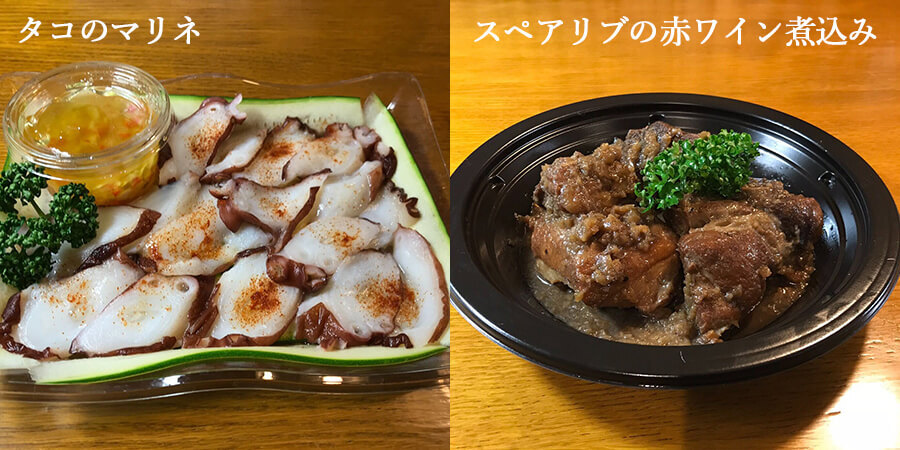

  

    <h2 class="mv__content--heading">TAKEOUT MENU</h2>
  

  <section class="food">
    

      <h3 class="takeout--heading">テイクアウトメニュー</h3>
      
期間限定でテイクアウト始めました。 当店ならではの味をご家庭でもお楽しみください。

      
*テイクアウトTEL受付時間は 15:00~19:00です。

      
*テイクアウト商品は全て税込です。

    

    

      

        

          
          
          
        

        

          

            <h3 class="food__list--heading1">パエリアは注文を受けて生米から作り始めますので、テイクアウト希望時間の1時間前までにご注文をお願いします。</h3>
            

              

                
魚介類のパエリア（2~3人前）

                
¥2,500-

              

              

                
きのこのパエリア（2~3人前）

                
¥2,300-

              

              

                
鶏肉のパエリア（2~3人前）

                
¥2,500-

              

              

                
スペインの生ハム（ハモン・セラーノ）

                
¥950-

              

              

                
 スペインオムレツ

                
¥800-

              

              

                
タコのマリネ

                
¥780-

              

              

                
タコのガリシア風

                
¥780-

              

            

          

        

      

    

  </section>
